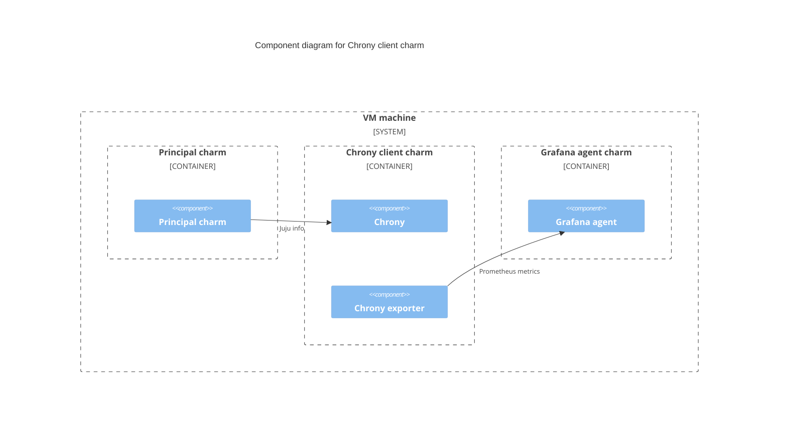

# Charm architecture

At its core, the Chrony client charm installs and configures the 
`chrony` and `chrony_exporter` services.

The Chrony client charm is a subordinate charm, meaning it is designed
to be deployed adjacent to another charm and to augment the
functionality of that charm. In this case, it helps to set up Chrony as
a NTP client.

<!-- vale Canonical.007-Headings-sentence-case = NO -->
## High-level overview of Chrony client charm deployment
<!-- vale Canonical.007-Headings-sentence-case = YES -->

The following diagram shows a typical deployment of the Chrony client
charm in a VM environment. The principal charm here can be any 
non-subordinate machine charm.



## Metrics

See [metrics](../reference/metrics.md) for more information.

## Juju events

Juju events allow progression of the charm through its lifecycle and
encapsulate part of the execution context of a charm. Below is a list of
observed events for the Chrony client charm and how the charm reacts
to each event. For more information about the charm’s lifecycle in
general, refer to the charm’s lifecycle [documentation](https://canonical-juju.readthedocs-hosted.com/en/latest/user/reference/hook/).

### `install`

The `install` event is emitted once per unit at the beginning of a
charm’s lifecycle. The charm will install `chrony` and `chrony_exporter`
during this event. See the documentation on the [`install` event](https://documentation.ubuntu.com/juju/latest/reference/hook/index.html#install).

### `upgrade-charm`

The `upgrade-charm` hook always runs once immediately after the charm
directory contents have been changed by an unforced charm upgrade
operation and may run after a forced upgrade, but it will not run
following a forced upgrade from an existing error state. During this
event, the Chrony client charm will upgrade the installed `chrony` or
`chrony_exporter`. See the documentation on the [`upgrade-charm` event](https://documentation.ubuntu.com/juju/latest/reference/hook/index.html#hook-upgrade-charm).

### `config-changed`

The `config-changed` hook always runs once immediately after the initial
install, after `leader-elected` hooks, and after the `upgrade-charm` hook.
It also runs whenever application configuration changes. During this
event, the Chrony client charm will update the configuration of `chrony`
and may restart the `chrony` service if the configuration has changed.
See the documentation on the [`config-changed` event](https://documentation.ubuntu.com/juju/latest/reference/hook/index.html#config-changed).

### `remove`
The `remove` event is emitted only once per unit: when the Juju controller
is ready to remove the unit completely. All necessary steps for handling
removal should be handled there. During this event, the Chrony client 
charm remove some installed packages and reset the chrony configuration
back to default. See the documentation on the [`remove` event](https://documentation.ubuntu.com/juju/latest/reference/hook/index.html#remove).

## Charm code overview

The `src/charm.py` is the default entry point for a charm and has the 
`ChronyClientCharm` Python class which inherits from `CharmBase`. 
`CharmBase` is the base class from which all charms are formed, defined
by [Ops](https://ops.readthedocs.io/en/latest/index.html) (Python
framework for developing charms).

> See more in the Juju docs: [Charm](https://documentation.ubuntu.com/juju/latest/user/reference/charm/)

The `__init__` method guarantees that the charm observes all events
relevant to its operation and handles them.

Take, for example, when a configuration is changed by using the CLI.

1. User runs the configuration command:

```bash
juju config chrony-client sources=ntp://0.pool.ntp.org
```

2. A `config-changed` event is emitted.
3. In the `__init__` method is defined how to handle this event like this:

```python
self.framework.observe(self.on.config_changed, self._on_config_changed)
```

4. The method `_on_config_changed`, for its turn, will take the
   necessary actions such as waiting for all the relations to be ready
   and then configuring the containers.
